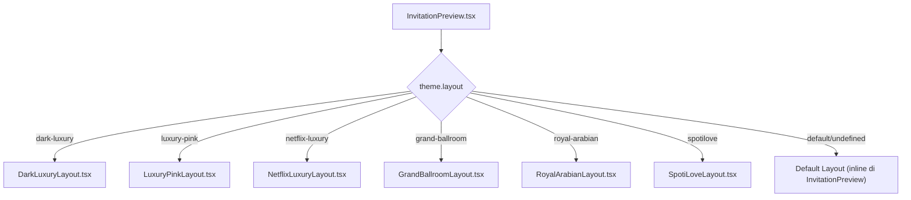

# Analisis Struktur Template Undangan Digital

## Arsitektur Rendering Template



> [!IMPORTANT]
> Setiap template adalah **file tsx mandiri** di `src/components/templates/`. Layout dipilih berdasarkan `ThemeConfig.layout` string. Untuk menambah template baru, cukup buat file baru + tambahkan `layout` ID baru di type + config + switch di InvitationPreview.

---

## Data Interface (Props Setiap Template)

Setiap layout menerima props **identik**:

```typescript
interface TemplateProps {
  data: WeddingData;      // Semua konten undangan
  theme: ThemeConfig;     // Konfigurasi warna, font, pattern
  guest?: Guest | null;   // Tamu yg sedang melihat (dari URL param)
  onAddRSVP: (rsvp: RSVP) => void;  // Callback kirim RSVP
  rsvps: RSVP[];          // Daftar RSVP yang sudah masuk
  embedded?: boolean;     // true = preview di editor (skip lock screen)
}
```

---

## ThemeConfig — Token Desain

| Field | Tipe | Contoh | Fungsi |
|---|---|---|---|
| `id` | string | `'rfx-dark'` | Identifier unik |
| `name` | string | `'Dark Luxury Cinematic'` | Label UI |
| `layout` | string | `'dark-luxury'` | **Menentukan file TSX mana yg di-render** |
| `primaryHex` | hex | `'#DC2626'` | Warna utama (aksen, CTA, border) |
| `secondaryHex` | hex | `'#EF4444'` | Warna sekunder (gradient partner) |
| `bgHex` | hex | `'#050505'` | Background utama |
| `textHex` | hex | `'#E4E4E7'` | Warna teks body |
| `accentHex` | hex | `'#DC2626'` | Warna highlight tambahan |
| `fontSerif` | class | `'font-serif'` | Tailwind font class untuk heading |
| `fontSans` | class | `'font-sans'` | Tailwind font class untuk body |
| `pattern` | enum | `'modern'` | Kategori visual (floral/classic/modern/minimalist) |

> [!TIP]
> Warna diterapkan via **CSS custom properties** (`--theme-primary`, `--theme-bg`, dll) yang di-set di root `<div>` template. Ini memungkinkan satu template menerima berbagai skema warna tanpa hardcode.

---

## WeddingData — Konten Dinamis

| Bagian | Field | Render Di Seksi |
|---|---|---|
| **Couple** | `groom`/`bride`: fullName, nickname, fatherName, motherName, instagram, photoUrl, about | Cover, Profil Mempelai |
| **Events** | `akad` & `resepsi`: name, date, time, venue, address, googleMapsUrl | Detail Acara (Cards) |
| **Love Stories** | array of `{year, title, story, imageUrl}` | Timeline/Cerita Cinta |
| **Gallery** | array of image URLs | Galeri Foto |
| **Gifts** | array of `{type, name, accountNumber, accountHolder}` | Kado Digital |
| **Music** | `musicUrl`, `musicTitle` | Audio player + floating nav |
| **Quote** | `quoteText`, `quoteSource` | Kutipan Suci |
| **Settings** | `countdownDate`, `ogImageUrl`, `bgImageUrl`, `showLoveStories`, `enableDigitalPass` | Countdown, OG, BG custom |

---

## 10 Seksi Wajib Setiap Template

Berdasarkan analisis 6 template yang ada, berikut **seksi standar** yang harus ada:

| # | Seksi | Deskripsi | Conditional? |
|---|---|---|---|
| 1 | **Lock Screen / Cover** | Layar pembuka dengan nama mempelai + "Buka Undangan" button. Memulai musik. | Selalu ada, skip jika `embedded=true` |
| 2 | **Hero Header** | Nama mempelai besar + tanggal + background foto | Selalu |
| 3 | **Kutipan Suci** | Quote text + source | Jika `data.quoteText` ada |
| 4 | **Profil Mempelai** | Foto, nama lengkap, orang tua, Instagram | Selalu |
| 5 | **Detail Acara** | Akad + Resepsi cards (tanggal, waktu, venue, maps) | Cek `enabled !== false` |
| 6 | **Love Stories** | Timeline/carousel cerita cinta | Jika `data.showLoveStories` + ada stories |
| 7 | **Galeri Foto** | Grid gambar | Jika `data.gallery.length > 0` |
| 8 | **Kado Digital** | Kartu rekening/e-wallet/alamat + tombol copy | Jika `data.gifts.length > 0` |
| 9 | **RSVP & Guestbook** | Form RSVP (nama, status, jumlah tamu, ucapan) + daftar ucapan | Selalu |
| 10 | **Footer** | Nama mempelai + "Terima Kasih" + floating music nav | Selalu |

---

## Pola Implementasi Internal

### 1. CSS Custom Properties (Wajib)
```tsx
<div style={{
  '--theme-primary': theme.primaryHex,
  '--theme-secondary': theme.secondaryHex,
  '--theme-bg': theme.bgHex,
  '--theme-text': theme.textHex,
  '--theme-accent': theme.accentHex,
  backgroundColor: 'var(--theme-bg)',
  color: 'var(--theme-text)',
}} />
```

### 2. State Management (Wajib)
```tsx
const [isOpen, setIsOpen] = useState(embedded ? true : false);   // Lock screen
const [isPlaying, setIsPlaying] = useState(false);                // Music
const audioRef = useRef<HTMLAudioElement>(null);                   // Audio element
const contentRef = useRef<HTMLDivElement>(null);                   // Scroll target

// RSVP Form
const [rsvpStatus, setRsvpStatus] = useState<'Hadir'|'Tidak Hadir'|'Ragu-ragu'>('Hadir');
const [rsvpPaxCount, setRsvpPaxCount] = useState(1);
const [rsvpWishes, setRsvpWishes] = useState('');
const [rsvpGuestName, setRsvpGuestName] = useState('');
const [rsvpSuccess, setRsvpSuccess] = useState(false);
```

### 3. Handler Functions (Wajib)
- `handleOpen()` → buka undangan + play musik + scroll ke konten
- `toggleMusic()` → play/pause audio
- `formatDate(dateStr)` → format tanggal Indonesia
- `handleRSVPSubmit(e)` → kirim RSVP + reset form
- `getImageUrl(url)` → resolve Google Drive URLs

### 4. Helper Components (Pattern Umum)
- `GoldText` / `AccentText` → Gradient text menggunakan theme colors
- `Divider` / `SectionDivider` → Pemisah antar seksi
- Inline `<style>` untuk animasi kustom (reveal, shine, pulse, dll)

---

## Perbandingan 6 Template Existing

| Template | Mood | BG Mode | Keunikan Visual |
|---|---|---|---|
| **DarkLuxury** | Gelap mewah | Dark (#050505) | Gold gradient text, grayscale→color hover, card glow |
| **LuxuryPink** | Feminin romantis | Terang (#FFF1F2) | Floral accents, soft pink palette, rounded cards |
| **NetflixLuxury** | Dark modern | Dark (#0A0A0A) | Netflix-style card layout, cinematic transitions |
| **GrandBallroom** | Klasik mewah | Terang (#FFFBEB) | Gold/amber palette, ornamental dividers |
| **RoyalArabian** | Dark eksotis | Dark (#0C1222) | Green+gold, Islamic pattern ornaments, moon motif |
| **SpotiLove** | Modern playful | Dark (#121212) | Spotify-style cards, playlist UI, green accent |

---

## Kriteria & Checklist Membuat Template Baru

### File Baru yang Dibutuhkan
1. `src/components/templates/[NamaLayout].tsx` — Komponen utama

### Modifikasi File Existing
1. [types.ts](file:///g:/ridho%20titip/Ridho/wedding_invitation/src/types.ts#L19) — Tambah layout ID ke union type
2. [defaultData.ts](file:///g:/ridho%20titip/Ridho/wedding_invitation/src/data/defaultData.ts#L8) — Tambah ThemeConfig baru
3. [InvitationPreview.tsx](file:///g:/ridho%20titip/Ridho/wedding_invitation/src/components/InvitationPreview.tsx#L211) — Tambah `if (theme.layout === 'xxx')` switch

### Checklist Implementasi
- [ ] Props interface sesuai standard (`data`, `theme`, `guest`, `onAddRSVP`, `rsvps`, `embedded`)
- [ ] CSS custom properties (`--theme-primary`, `--theme-bg`, dll)
- [ ] Lock screen dengan tombol "Buka Undangan" (skip jika `embedded`)
- [ ] Audio ref + play on open + floating music button
- [ ] 10 seksi standar (cover → footer)
- [ ] Guest name personalization dari URL params
- [ ] RSVP form dengan 3 status (Hadir/Tidak Hadir/Ragu-ragu)
- [ ] RSVP success state + ucapan list
- [ ] Google Drive URL resolver
- [ ] Responsive design (mobile-first)
- [ ] Animasi entry (reveal, fade, slide)
- [ ] Floating navigation bar di bawah

### Potensi Varian Template Baru

| Ide | Layout ID | Mood | Keunikan |
|---|---|---|---|
| Rustic Garden | `rustic-garden` | Warm natural | Kraft paper texture, botanical illustrations, earth tones |
| Minimalist White | `minimal-white` | Clean modern | Whitespace-heavy, thin sans-serif, minimal color |
| Javanese Classic | `javanese-classic` | Traditional | Batik patterns, wayang silhouettes, gold+maroon |
| Beach/Tropical | `tropical-beach` | Bright tropical | Watercolor palms, coral palette, wave animations |
| Magazine Editorial | `editorial-mag` | High fashion | Full-bleed photos, editorial typography, asymmetric |
| Neon Cyberpunk | `neon-cyber` | Futuristic | Dark bg, neon glow effects, glitch animations |

---

> [!NOTE]
> Semua 6 template menggunakan **Phosphor Icons Duotone** (`react-icons/pi`) untuk konsistensi ikon. Template baru wajib mengikuti konvensi ini.
